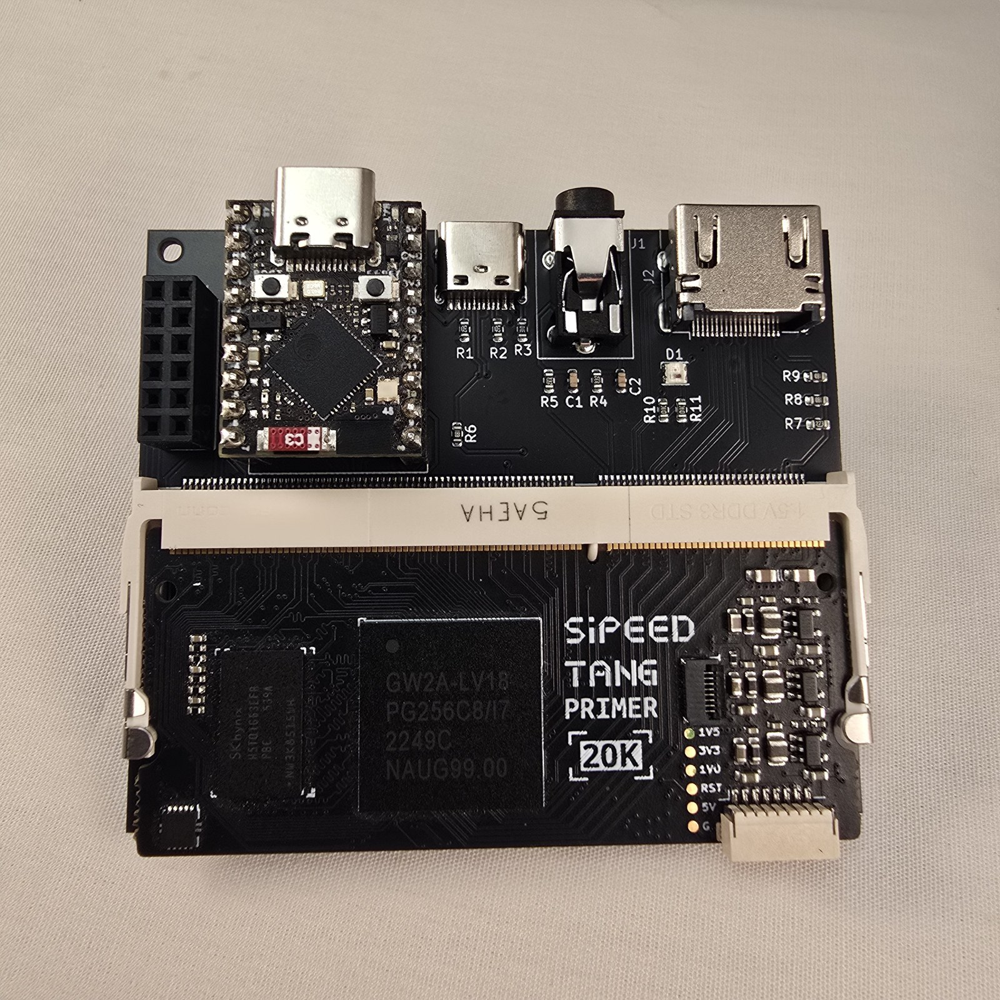

# Flash the Firmware

Before anything else works, the ESP32-S3 SuperMini needs **FPGA-Companion** firmware installed. This is a one-time step — OTA updates handle everything after this.

---

## What is FPGA-Companion?

FPGA-Companion is the open-source firmware that runs on the ESP32-S3. It provides:
- The on-screen display (OSD) menu
- Bluetooth gamepad pairing
- WiFi OTA updates for FPGA bitfiles
- SD card ROM management
- JTAG communication with the FPGA

Source: [https://github.com/Papilio-Retrocade/FPGA-Companion](https://github.com/Papilio-Retrocade/FPGA-Companion)

---

## What You Need

- ESP32-S3 SuperMini (not yet plugged into the Retrocade for this step)
- USB-C cable
- Computer with a USB port (Windows users can use the one-click installer; Mac/Linux need **Python 3.12+**)
- The FPGA-Companion firmware binary (`.bin` file)

---

## Step 1: Download the Firmware

1. Go to the [FPGA-Companion releases page](https://github.com/Papilio-Retrocade/FPGA-Companion/releases/latest) — the current release is **v1.0.1**
2. Download **`fpga-companion-esp32s3-v1.0.1-merged.bin`**

This merged image bundles the bootloader, partition table, and application into a single file that flashes at address `0x0` — the simplest option for a fresh ESP32-S3 SuperMini.

:::tip
Advanced users who prefer to flash the bootloader, partition table, and app as separate files (e.g. for OTA-only application updates) can instead download `fpga-companion-esp32s3-v1.0.1.zip`, which contains the individual binaries and their flash offsets — see the release notes on the [releases page](https://github.com/Papilio-Retrocade/FPGA-Companion/releases/latest) for details.
:::

:::warning No WiFi out of the box
The pre-built binary ships with a **placeholder WiFi SSID** — it will not connect to your network. WiFi is only needed for OTA core pushing and remote logging; USB flashing and SD-card core loading work fully offline. If you want WiFi features, see [Connect to WiFi](./load-a-core#step-1-wifi-is-optional-and-not-yet-configurable-from-the-osd) on the next page for how to build your own binary with real credentials.
:::

---

## Step 2: Install Papilio Loader

Papilio Loader is the official tool for flashing Papilio hardware.

**Windows users:** the easiest route is the one-click installer — no Python needed. Download `PapilioLoader-Setup-x.x.x.exe` from the [releases page](https://github.com/Papilio-Labs/papilio-loader-mcp/releases), install it, launch **Papilio Loader** from the Start Menu, then right-click the system tray icon and choose **Open Web Interface**.

**Mac, Linux, or pip users:** install the Python package instead (requires Python 3.12+):

```bash
pip install papilio-loader-mcp
```

Then start the Papilio Loader server:

```bash
python -m papilio_loader_mcp.api
```

Either way, open your browser to **[http://localhost:8000/web/upload](http://localhost:8000/web/upload)**. You should see the Device Flash Manager:


:::tip
Papilio Loader can do a lot more than first-time flashing — OTA updates over WiFi, a saved firmware library, live WiFi logs, and an API. See the full [Papilio Loader documentation](../papilio-loader/index.md).
:::

---

## Step 3: Flash the Firmware

1. Hold the **BOOT button** on the ESP32-S3 SuperMini
2. Plug in the USB-C cable while holding BOOT
3. Release BOOT after 2 seconds — the device is now in bootloader mode
4. In the Papilio Loader web UI, under **ESP32 Flash**, select **USB/Serial**, then click **Click to select .bin or .elf file** and choose the merged `.bin` file you downloaded
5. Click **⚙️ Advanced Options** and set **Flash Address (hex)** to `0x0` — the merged image includes the bootloader, so it must be written starting at address zero, not the default `0x10000` app partition
6. Click **Flash ESP32** and wait for the flash to complete (~30 seconds)
7. Unplug and replug USB-C — the green LED should blink

---

## Step 4: Verify It Worked

1. After reflashing, unplug USB from your computer
2. Plug the ESP32-S3 SuperMini into the Retrocade board header
3. Connect HDMI to a monitor
4. Power via USB-C into the Retrocade's USB-C port
5. You should see the FPGA-Companion OSD on your screen

When fully assembled, the system looks like this — ESP32-S3 in its header at the top-left, Tang Primer 20K in the SO-DIMM socket:



:::tip
If you see nothing on screen, check that the HDMI cable is connected to the **Retrocade board** (not the Tang Primer 20K). Also confirm the ESP32-S3 is seated fully in its header pins.
:::

---

## Troubleshooting

| Symptom | Fix |
|---|---|
| Device not detected by computer | Try a different USB-C cable — many are charge-only with no data lines |
| Flash fails with "port not found" | Check Device Manager (Windows) or `ls /dev/tty*` (Linux/Mac) for the correct port |
| Nothing on HDMI after flash | Confirm ESP32-S3 is in the correct header orientation |
| Green LED doesn't blink | Re-flash. Confirm you used the Retrocade-specific binary, not a generic FPGA-Companion build |

---

## Next Step

Firmware is installed. Now push a game core to the FPGA:

**[Load a Core (OTA JTAG) →](./load-a-core)**

---

## 🎓 Want to Go Deeper?

Understanding what FPGA-Companion is actually doing when it talks to the FPGA is fascinating. The FPGA Fundamentals course covers JTAG, the SPI communication between ESP32 and FPGA, and how to use AI to write your own peripheral bridges.

**[FPGA Fundamentals: AI as Your Co-Developer →](https://learn.papilioworks.com)**
