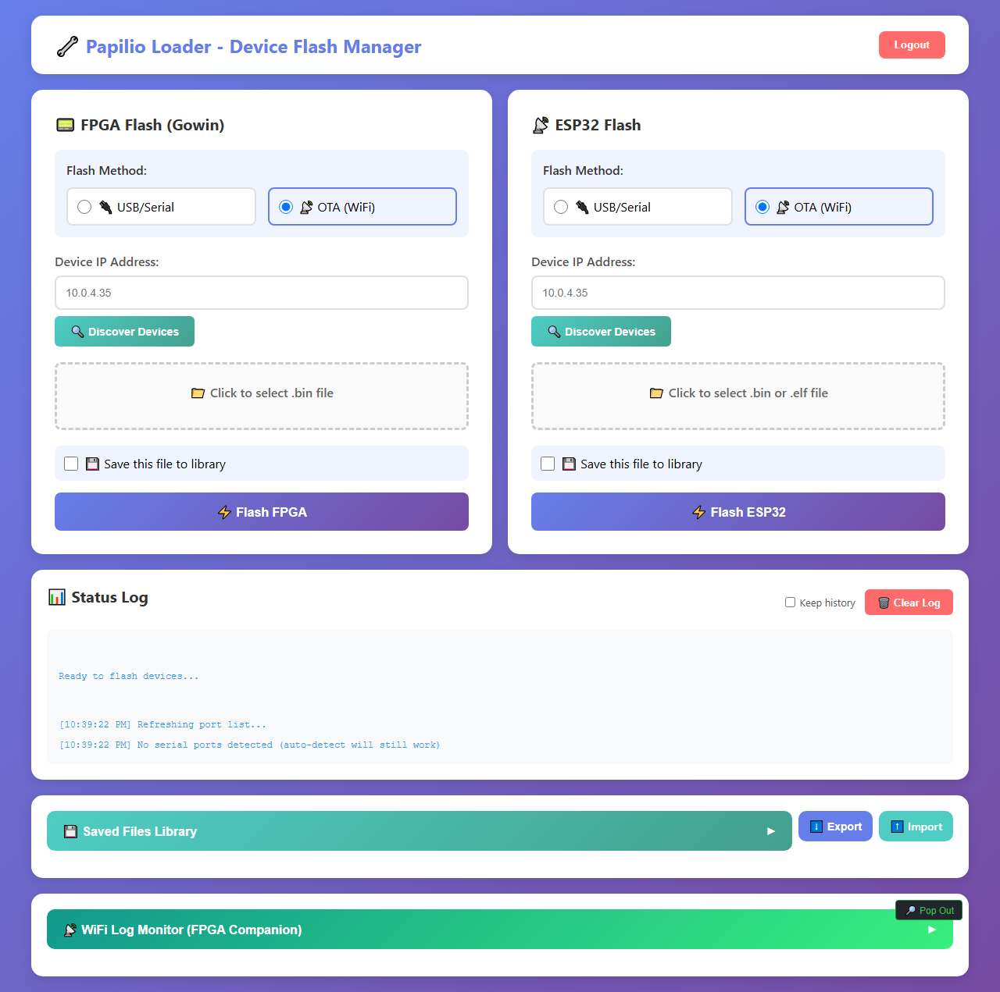

# Flash the Firmware

Before anything else works, the ESP32-S3 SuperMini needs **FPGA-Companion** firmware installed. This is a one-time step — OTA updates handle everything after this.

---

## What is FPGA-Companion?

FPGA-Companion is the open-source firmware that runs on the ESP32-S3. It provides:
- The on-screen display (OSD) menu
- Bluetooth gamepad pairing
- WiFi OTA updates for FPGA bitfiles
- SD card ROM management
- JTAG communication with the FPGA

Source: [https://github.com/Papilio-Retrocade/FPGA-Companion](https://github.com/Papilio-Retrocade/FPGA-Companion)

---

## What You Need

- ESP32-S3 SuperMini (not yet plugged into the Retrocade for this step)
- USB-C cable
- Computer with a USB port and **Python 3.12+** installed
- The FPGA-Companion firmware binary (`.bin` file)

---

## Step 1: Download the Firmware

:::note Content Coming Soon
Download links and version information will be added here once the first release is published.
:::

1. Go to the [FPGA-Companion releases page](https://github.com/Papilio-Retrocade/FPGA-Companion/releases)
2. Download the latest `fpga-companion-retrocade-esp32s3.bin`

---

## Step 2: Install Papilio Loader

Papilio Loader is the official tool for flashing Papilio hardware. Install it with pip — this works on Windows, Mac, and Linux:

```bash
pip install papilio-loader-mcp
```

Once installed, start the Papilio Loader server:

```bash
python -m papilio_loader_mcp.api
```

Then open your browser to **[http://localhost:8000/web/upload](http://localhost:8000/web/upload)**. You should see the Device Flash Manager:



:::tip
Papilio Loader can do a lot more than first-time flashing — OTA updates over WiFi, a saved firmware library, live WiFi logs, and an API. See the full [Papilio Loader documentation](../papilio-loader/index.md).
:::

:::tip
Don't have Python? Download it from [python.org](https://www.python.org/downloads/) — Python 3.12 or newer is required.
:::

---

## Step 3: Flash the Firmware

1. Hold the **BOOT button** on the ESP32-S3 SuperMini
2. Plug in the USB-C cable while holding BOOT
3. Release BOOT after 2 seconds — the device is now in bootloader mode
4. In the Papilio Loader web UI, under **ESP32 Flash**, select **USB/Serial**, choose your serial port, click to select the `.bin` file you downloaded, and click **Flash ESP32**
5. Wait for the flash to complete (~30 seconds)
6. Unplug and replug USB-C — the green LED should blink

---

## Step 4: Verify It Worked

1. After reflashing, unplug USB from your computer
2. Plug the ESP32-S3 SuperMini into the Retrocade board header
3. Connect HDMI to a monitor
4. Power via USB-C into the Retrocade's USB-C port
5. You should see the FPGA-Companion OSD on your screen

:::tip
If you see nothing on screen, check that the HDMI cable is connected to the **Retrocade board** (not the Tang Primer 20K). Also confirm the ESP32-S3 is seated fully in its header pins.
:::

---

## Troubleshooting

| Symptom | Fix |
|---|---|
| Device not detected by computer | Try a different USB-C cable — many are charge-only with no data lines |
| Flash fails with "port not found" | Check Device Manager (Windows) or `ls /dev/tty*` (Linux/Mac) for the correct port |
| Nothing on HDMI after flash | Confirm ESP32-S3 is in the correct header orientation |
| Green LED doesn't blink | Re-flash. Confirm you used the Retrocade-specific binary, not a generic FPGA-Companion build |

---

## Next Step

Firmware is installed. Now push a game core to the FPGA:

**[Load a Core (OTA JTAG) →](./load-a-core)**

---

## 🎓 Want to Go Deeper?

Understanding what FPGA-Companion is actually doing when it talks to the FPGA is fascinating. The FPGA Fundamentals course covers JTAG, the SPI communication between ESP32 and FPGA, and how to use AI to write your own peripheral bridges.

**[FPGA Fundamentals: AI as Your Co-Developer →](https://learn.papilioworks.com)**
