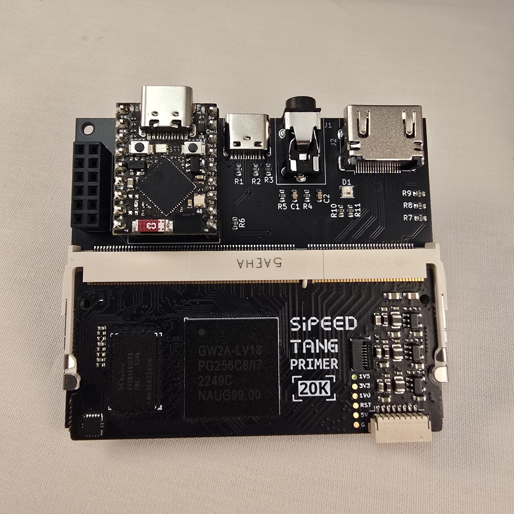

# Flash the Firmware

Before anything else works, the ESP32-S3 SuperMini needs two pieces of software: the **Papilio ESP Bootloader**, which lets you program and recover the board, and the **FPGA-Companion** app, which provides the on-screen menu, ROM loading, and controller support for the game core running on the FPGA. This page installs both in one step.

:::tip[Prefer no install at all?]
The **[browser-based Getting Started flasher](https://papilioworks.com/getting-started/)** does this whole page — bootloader recovery, WiFi setup, the latest A2600 core, and the Papilio Splash ROM — from a single guided page in Chrome or Edge, no download or install required. Use it instead of the manual setup below if you'd rather not install Papilio Loader locally.
:::

---

## What is the Papilio ESP Bootloader?

The Papilio ESP Bootloader is a small program that is permanently installed on the board's ESP32. It is what makes the board easy to program and hard to break. In order of importance, it lets you:

1. **Program the FPGA.** Load a game core or your own design onto the FPGA, over USB or over WiFi, with no special programmer. This is how you switch to a different core: program the new core with Papilio Loader.
2. **Update the ESP32 firmware.** Install new versions of FPGA-Companion over USB or over WiFi. Use USB the first time, then WiFi for everyday updates so the board can stay plugged into your TV.
3. **Recover a board that won't start.** If an update goes wrong or the board shows nothing on screen, reconnect USB and reinstall. The bootloader is kept separate from FPGA-Companion, so a bad update can't lock you out.
4. **Join your WiFi network.** You enter your network name and password once, and the board remembers them.

**Papilio Loader uses the bootloader to program both sides of the board:** the ESP32 firmware and the FPGA bitstream, over **USB** or **WiFi**. Use USB for first-time setup and whenever the board isn't on your network yet; use WiFi once it is.

Technical details: flash layout

The bootloader also keeps two application slots, so a failed update can be rolled back to the last working version automatically. The current 4 MB flash layout is:

| Partition | Address | Purpose |
| --- | ---: | --- |
| `factory` | `0x20000` | Papilio ESP Bootloader |
| `ota_0` | `0x100000` | Active FPGA-Companion application |
| `ota_1` | `0x280000` | Rollback FPGA-Companion application |

## What is FPGA-Companion?

FPGA-Companion is the open-source app that runs on the ESP32-S3 whenever you're playing. The bootloader and Papilio Loader get software onto the board; the Companion is what you use day to day with the core that is running on the FPGA.

In order of importance, it:

1. **Loads and manages ROMs.** Browse games on the SD card from the on-screen menu and load them into the running core. You can also send a ROM to the board over WiFi.
2. **Provides game controller input.** Pair a Bluetooth gamepad, and the Companion passes its buttons to the core.
3. **Shows the on-screen menu (OSD).** Pick ROMs and adjust settings from your TV with your controller.
4. **Recognizes the running core** and shows the menu and controls that match it.

The Companion does not program the FPGA or switch cores. The core on the FPGA is whichever one you last programmed with Papilio Loader. See [Core Compatibility](../cores/compatibility) for the available cores and their status.

Source: [https://github.com/Papilio-Retrocade/FPGA-Companion](https://github.com/Papilio-Retrocade/FPGA-Companion)

---

## What You Need

- ESP32-S3 SuperMini (not yet plugged into the Retrocade for this step)
- USB-C cable
- Chrome or Edge with Web Serial support for the browser-based setup, or Papilio Loader for manual flashing
- A USB data cable, not a charge-only cable

---

## Recommended: Browser-Based Setup

The [browser-based Getting Started flasher](https://papilioworks.com/getting-started/) is the easiest way to prepare a blank board. It downloads the current Papilio ESP32 Bootloader, FPGA Companion ESP32 app, A2600 Retrocade FPGA core, and Papilio Splash ROM from their published releases and performs the complete first-time flow:

1. Hold **BOOT** while powering the ESP32-S3 over USB.
2. Open the Getting Started flasher in Chrome or Edge.
3. Click **Connect USB**, select the ESP32-S3 port, then click **Install / Recover Board**.
4. Wait for **ESP32 flashed**. The page closes and reopens the USB connection while the board re-enumerates.
5. Enter WiFi credentials and click **Send to Board**.
6. Click **Install Latest A2600 Core**. The page uses WiFi when the board IP is known, or USB serial when it is not.
7. Insert a FAT-formatted SD card, then click **Load Papilio Splash ROM**. The ROM is written to the card and requested from the active core.

The ROM upload requires the board to be reachable over WiFi because the Companion's `/rom-load` endpoint writes to the SD card. If the page reports that the ROM was saved but not inserted, close the on-screen display and retry the ROM action.

The recovery image writes the factory bootloader and a compatible Companion application in one USB operation. Use it for a new board or to migrate a board that still uses the older application-centered layout.

:::warning[Use the recovery image only for migration]
Do not flash a normal FPGA-Companion application image over the factory partition. After migration, update the application with Papilio Loader, which installs app-only updates safely beside your current version.
:::

---

## Manual Setup with Papilio Loader

Papilio Loader is the official tool for programming Papilio hardware. It can program the **ESP32 firmware** and **FPGA bitstreams** over **USB** or **WiFi**:

- **USB:** recover or program the ESP32, and program the FPGA when WiFi is unavailable.
- **WiFi:** update the ESP32 application and program the FPGA remotely after the board has joined your network.

Use the **[Web Edition](https://papilioworks.com/loader/)** in Chrome or Edge with nothing to install, or install the Windows **Desktop App**: download `PapilioLoader-Setup-x.x.x.exe` from the [releases page](https://github.com/Papilio-Labs/papilio-loader-mcp/releases) and launch **Papilio Loader** from the Start Menu.

:::tip
Papilio Loader can do more than first-time setup, including finding boards on your network, a saved files library, live WiFi logs, and AI assistant support. See the full [Papilio Loader documentation](../papilio-loader/index.md).
:::

---

## Manual Migration

1. Hold the **BOOT button** on the ESP32-S3 SuperMini
2. Plug in the USB-C cable while holding BOOT
3. Release BOOT after 2 seconds — the device is now in ROM download mode
4. Use the migration image from the browser-based Getting Started flow, or from the [FPGA-Companion v2.0.0 release](https://github.com/Papilio-Retrocade/FPGA-Companion/releases/tag/v2.0.0) (`papilio-migration-v2.0.0-merged.bin`)
5. In Papilio Loader, click **Connect USB** and choose the board's port, then choose the migration `.bin` on the **ESP32 Flash** card. Loader recognizes the merged image and writes it from the start of flash.
6. Click **Program ESP32** and wait for it to finish
7. Reconnect to USB, enter your WiFi credentials, and use Papilio Loader for future updates

---

## Verify the Migration

1. After reflashing, unplug USB from your computer
2. Plug the ESP32-S3 SuperMini into the Retrocade board header
3. Connect HDMI to a monitor
4. Power via USB-C into the Retrocade's USB-C port
5. You should see the FPGA-Companion OSD on your screen. The bootloader remains installed in the factory partition and continues to provide recovery and update services independently of the OSD application.

When fully assembled, the system looks like this — ESP32-S3 in its header at the top-left, Tang Primer 20K in the SO-DIMM socket:

:::tip
If you see nothing on screen, check that the HDMI cable is connected to the **Retrocade board** (not the Tang Primer 20K). Also confirm the ESP32-S3 is seated fully in its header pins.
:::

---

## Troubleshooting

| Symptom | Fix |
|---|---|
| Device not detected by computer | Try a different USB-C cable — many are charge-only with no data lines |
| Flash fails with "port not found" | Check Device Manager (Windows) or `ls /dev/tty*` (Linux/Mac) for the correct port |
| Nothing on HDMI after flash | Confirm ESP32-S3 is in the correct header orientation |
| Green LED doesn't blink | Re-flash the migration image from the start of flash. Confirm you used the Retrocade-specific migration image, not an app-only FPGA-Companion build |
| WiFi setup says the serial port cannot be opened | Wait for the board to finish rebooting and USB re-enumeration, then retry **Send to Board** |

---

## Next Step

Firmware is installed. Now push a game core to the FPGA:

**[Load a Core →](./load-a-core)**

---

## 🎓 Want to Go Deeper?

Understanding what FPGA-Companion is actually doing when it talks to the FPGA is fascinating. The FPGA Fundamentals course covers JTAG, the SPI communication between ESP32 and FPGA, and how to use AI to write your own peripheral bridges.

**[FPGA Fundamentals: AI as Your Co-Developer →](https://learn.papilioworks.com)**
