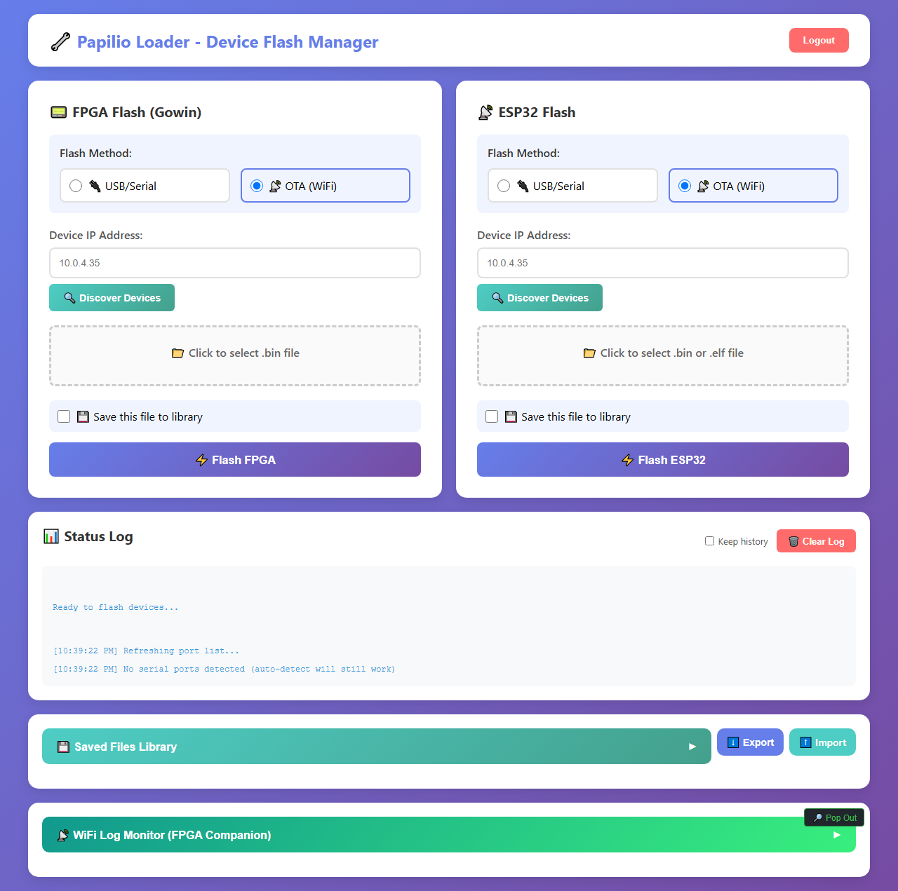

# Flash the Firmware

Before anything else works, the ESP32-S3 SuperMini needs the **Papilio ESP Bootloader** and a compatible **FPGA-Companion** application. The bootloader is a small, always-resident recovery and update system in the ESP32's factory partition; the Companion app runs in one of its OTA application slots.

:::tip[Prefer no install at all?]
The **[browser-based Getting Started flasher](https://papilioworks.com/getting-started/)** does this whole page — bootloader recovery, WiFi setup, the latest A2600 core, and the Papilio Splash ROM — from a single guided page in Chrome or Edge, no download or install required. Use it instead of the manual setup below if you'd rather not install Papilio Loader locally.
:::

---

## What is the Papilio ESP Bootloader?

The Papilio ESP Bootloader is the board's permanent factory-resident firmware. It provides:

- USB firmware recovery and programming
- WiFi provisioning and OTA application updates
- FPGA programming and recovery
- A/B application slots so an interrupted application update can be rolled back

The bootloader is independent of FPGA-Companion. After the one-time migration, you can recover or update the board even if the Companion application is missing or not starting.

**Papilio Loader programs both sides of the board:** it can flash ESP32 firmware and FPGA bitstreams over **USB** or **WiFi**. Use USB for first-time recovery and whenever the board is not yet on your network; use WiFi for normal firmware updates and FPGA programming after the bootloader and WiFi have been configured.

The current 4 MB flash layout is:

| Partition | Address | Purpose |
| --- | ---: | --- |
| `factory` | `0x20000` | Papilio ESP Bootloader |
| `ota_0` | `0x100000` | Active FPGA-Companion application |
| `ota_1` | `0x280000` | Rollback FPGA-Companion application |

## What is FPGA-Companion?

FPGA-Companion is the open-source firmware that runs on the ESP32-S3. It provides:
- The on-screen display (OSD) menu
- Bluetooth gamepad pairing
- WiFi OTA updates for FPGA bitfiles
- SD card ROM management
- JTAG communication with the FPGA

Source: [https://github.com/Papilio-Retrocade/FPGA-Companion](https://github.com/Papilio-Retrocade/FPGA-Companion)

---

## What You Need

- ESP32-S3 SuperMini (not yet plugged into the Retrocade for this step)
- USB-C cable
- Chrome or Edge with Web Serial support for the browser-based setup, or Papilio Loader for manual flashing
- A USB data cable, not a charge-only cable

---

## Recommended: Browser-Based Setup

The [browser-based Getting Started flasher](https://papilioworks.com/getting-started/) is the easiest way to prepare a blank board. It downloads the current recovery image, A2600 Retrocade FPGA core, and Papilio Splash ROM from their published releases and performs the complete first-time flow:

1. Hold **BOOT** while powering the ESP32-S3 over USB.
2. Open the Getting Started flasher in Chrome or Edge.
3. Click **Connect USB**, select the ESP32-S3 port, then click **Install / Recover Board**.
4. Wait for **ESP32 flashed**. The page closes and reopens the USB connection while the board re-enumerates.
5. Enter WiFi credentials and click **Send to Board**.
6. Click **Install Latest A2600 Core**. The page uses WiFi when the board IP is known, or USB serial when it is not.
7. Insert a FAT-formatted SD card, then click **Load Papilio Splash ROM**. The ROM is written to the card and requested from the active core.

The ROM upload requires the board to be reachable over WiFi because the Companion's `/rom-load` endpoint writes to the SD card. If the page reports that the ROM was saved but not inserted, close the on-screen display and retry the ROM action.

The recovery image writes the factory bootloader and a compatible Companion application in one USB operation. Use it for a new board or to migrate a board that still uses the older application-centered layout.

:::warning[Use the recovery image only for migration]
Do not flash a normal FPGA-Companion application image over the factory partition. After migration, update the application through the Papilio ESP Bootloader using OTA or the Papilio Loader recovery workflow.
:::

---

## Manual Setup with Papilio Loader

Papilio Loader is the official tool for programming Papilio hardware. It can flash **ESP32 firmware** and **FPGA bitstreams** over **USB** or **WiFi**:

- **USB:** recover or program the ESP32, and flash an FPGA bitstream when WiFi is unavailable.
- **WiFi:** update the ESP32 application and program or recover the FPGA remotely after the board has joined your network.

**Windows users:** the easiest route is the one-click installer — no Python needed. Download `PapilioLoader-Setup-x.x.x.exe` from the [releases page](https://github.com/Papilio-Labs/papilio-loader-mcp/releases), install it, launch **Papilio Loader** from the Start Menu, then right-click the system tray icon and choose **Open Web Interface**.

**Mac, Linux, or pip users:** install the Python package instead (requires Python 3.12+):

```bash
pip install papilio-loader-mcp
```

Then start the Papilio Loader server:

```bash
python -m papilio_loader_mcp.api
```

Either way, open your browser to **[http://localhost:8000/web/upload](http://localhost:8000/web/upload)**. You should see the Device Flash Manager:



:::tip
Papilio Loader can do a lot more than first-time flashing — OTA updates over WiFi, a saved firmware library, live WiFi logs, and an API. See the full [Papilio Loader documentation](../papilio-loader/index.md).
:::

---

## Manual Migration

1. Hold the **BOOT button** on the ESP32-S3 SuperMini
2. Plug in the USB-C cable while holding BOOT
3. Release BOOT after 2 seconds — the device is now in ROM download mode
4. Use the Papilio ESP Bootloader recovery image from the browser-based Getting Started flow, or the matching migration image from the [FPGA-Companion v2.0.0 release](https://github.com/Papilio-Retrocade/FPGA-Companion/releases/tag/v2.0.0)
5. In Papilio Loader, select **USB/Serial**, choose the recovery `.bin`, and set **Flash Address (hex)** to `0x0`
6. Click **Flash ESP32** and wait for the flash to complete
7. Reconnect to USB, provision WiFi, and use the bootloader-managed OTA flow for future application updates

---

## Verify the Migration

1. After reflashing, unplug USB from your computer
2. Plug the ESP32-S3 SuperMini into the Retrocade board header
3. Connect HDMI to a monitor
4. Power via USB-C into the Retrocade's USB-C port
5. You should see the FPGA-Companion OSD on your screen. The bootloader remains installed in the factory partition and continues to provide recovery and update services independently of the OSD application.

When fully assembled, the system looks like this — ESP32-S3 in its header at the top-left, Tang Primer 20K in the SO-DIMM socket:


:::tip
If you see nothing on screen, check that the HDMI cable is connected to the **Retrocade board** (not the Tang Primer 20K). Also confirm the ESP32-S3 is seated fully in its header pins.
:::

---

## Troubleshooting

| Symptom | Fix |
|---|---|
| Device not detected by computer | Try a different USB-C cable — many are charge-only with no data lines |
| Flash fails with "port not found" | Check Device Manager (Windows) or `ls /dev/tty*` (Linux/Mac) for the correct port |
| Nothing on HDMI after flash | Confirm ESP32-S3 is in the correct header orientation |
| Green LED doesn't blink | Re-flash the recovery image at `0x0`. Confirm you used the Retrocade-specific migration image, not an app-only FPGA-Companion build |
| WiFi provisioning says the serial port cannot be opened | Wait for the board to finish rebooting and USB re-enumeration, then retry **Send to Board** |

---

## Next Step

Firmware is installed. Now push a game core to the FPGA:

**[Load a Core (OTA JTAG) →](./load-a-core)**

---

## 🎓 Want to Go Deeper?

Understanding what FPGA-Companion is actually doing when it talks to the FPGA is fascinating. The FPGA Fundamentals course covers JTAG, the SPI communication between ESP32 and FPGA, and how to use AI to write your own peripheral bridges.

**[FPGA Fundamentals: AI as Your Co-Developer →](https://learn.papilioworks.com)**
