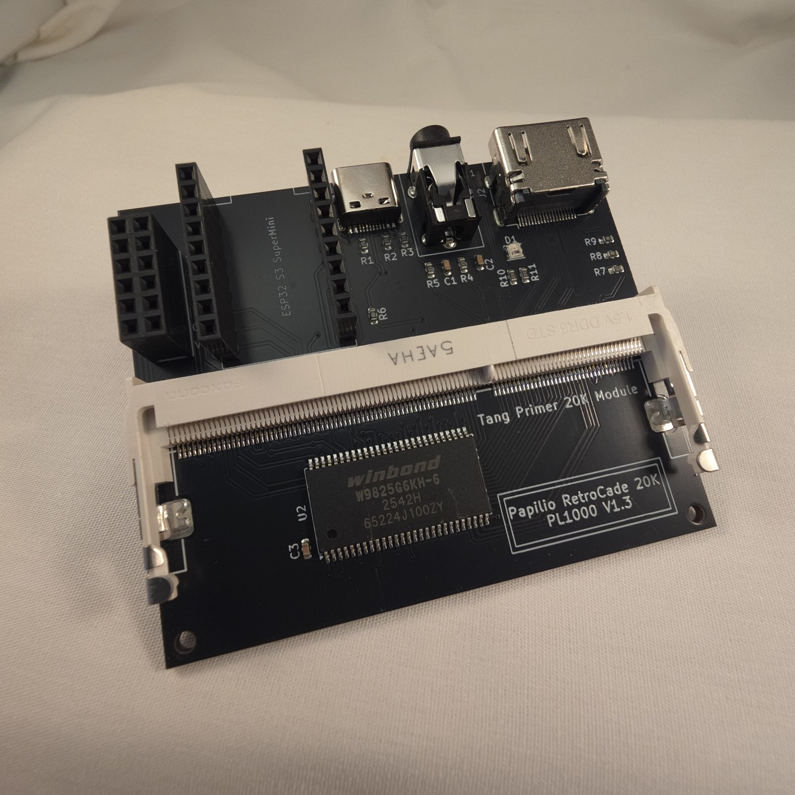
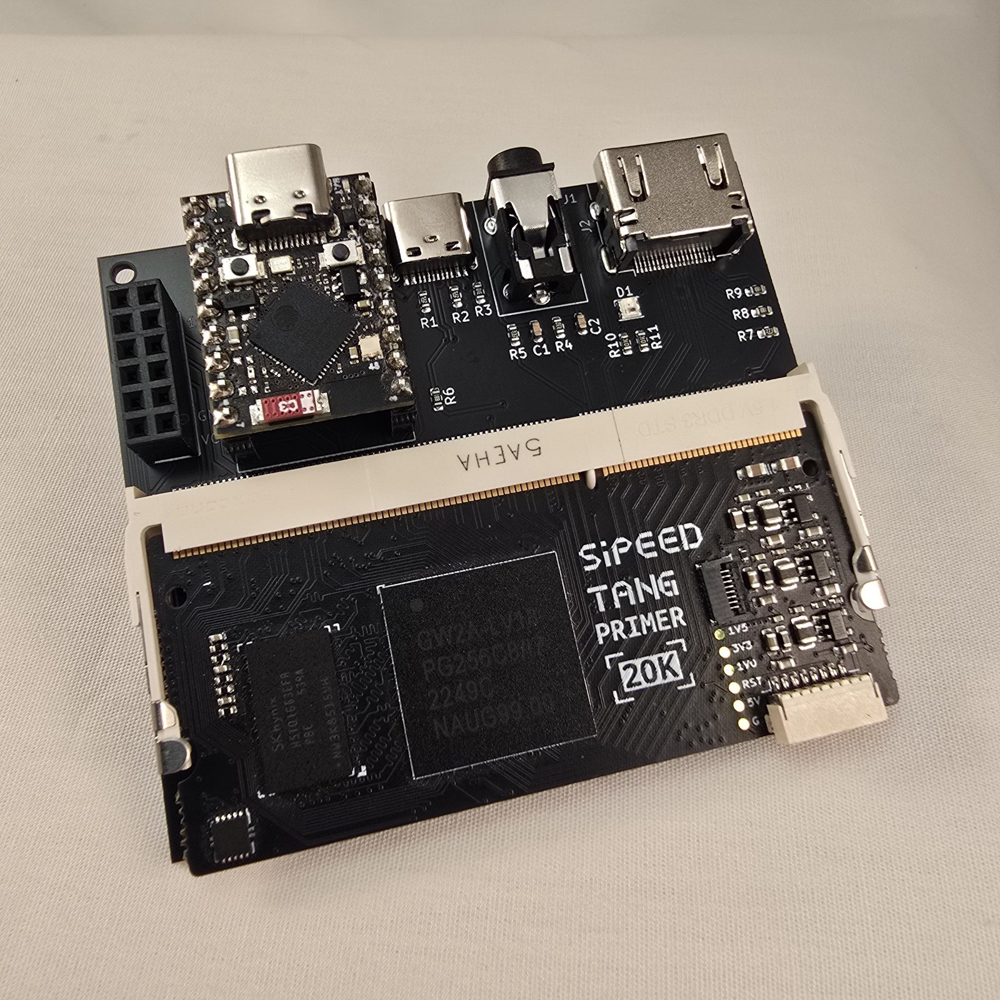

# Papilio Retrocade Daughterboard

Designed by Papilio Works. The main expansion board that connects the Tang Primer 20K FPGA module to the outside world.

Along the top edge, left to right: ESP32-S3 SuperMini header, USB-C power input, 3.5mm audio jack, and HDMI output. The Tang Primer 20K clips into the SO-DIMM socket below, and the Winbond SDRAM sits on the lower half of the board.

---

## Specifications

| Feature | Detail |
|---|---|
| SDRAM | Winbond W9825G6KH-6, 32 MB, 166 MHz |
| Video | HDMI output (differential pair) |
| Audio | 3.5mm stereo analog jack |
| Power | USB-C input, 5V |
| Expansion | PMOD connector (standard 12-pin) |
| Status LED | WS2812B RGB |
| Programmer | Onboard JTAG |
| FPGA Header | SO-DIMM-style, 200-pin |

---

:::note[Content Coming Soon]
Schematic reference, CST file pinout, and PCB dimension drawing will be added here.

Hardware design files are open source at: [github.com/Papilio-Retrocade/papilio_retrocade_hardware](https://github.com/Papilio-Retrocade)
:::

---

## 🎓 Want to Go Deeper?

The full hardware design story — why this board was designed this way, KiCad design files, schematic review, and how to spin your own expansion board:

**[Building FPGA Hardware Products →](https://learn.papilioworks.com)**
