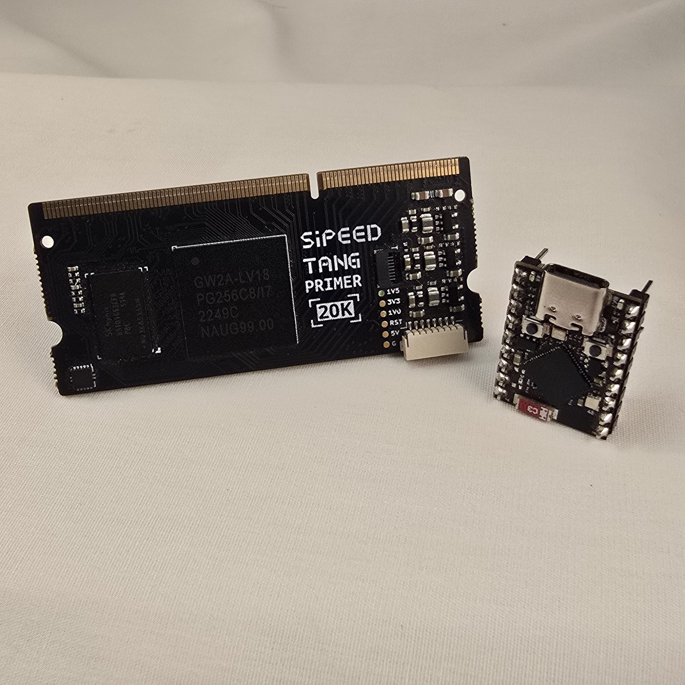

# Sipeed Tang Primer 20K

The FPGA core module. Made by Sipeed. Plugs into the Retrocade's SO-DIMM-style header.

The Gowin GW2A-LV18 FPGA and 128 MB DDR3 dominate the module; the gold SO-DIMM edge connector along the top carries all I/O to the Retrocade board. Shown with the ESP32-S3 SuperMini for scale.

---

## Specifications

| Feature | Detail |
|---|---|
| FPGA | Gowin GW2A-LV18PG256C8/I7 |
| Logic Elements | 20,736 LUTs |
| On-Module Memory | 128 MB DDR3 SDRAM |
| Flash | 32 Mbit NOR Flash |
| Clock | 27 MHz oscillator |
| Available I/O | 117 pins |
| Form Factor | SO-DIMM 200-pin module |

---

## Where to Buy

The Tang Primer 20K is made by Sipeed and available from:
- [AliExpress (Sipeed official store)](https://aliexpress.com)
- Amazon
- Various electronics distributors

Approximate price: $25–35 USD.

---

:::note Content Coming Soon
Detailed I/O mapping, JTAG pinout, and Gowin EDA toolchain setup instructions will be added here.
:::

---

## 🎓 Want to Go Deeper?

Setting up the Gowin EDA toolchain, understanding the Gowin synthesis flow, and using AI to write Verilog for the GW2A-18:

**[FPGA Fundamentals: AI as Your Co-Developer →](https://learn.papilioworks.com)**
