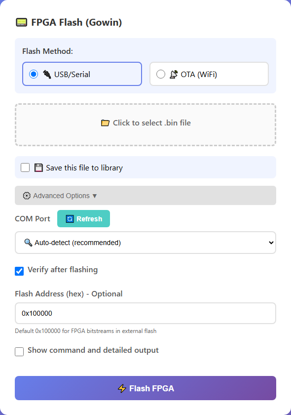
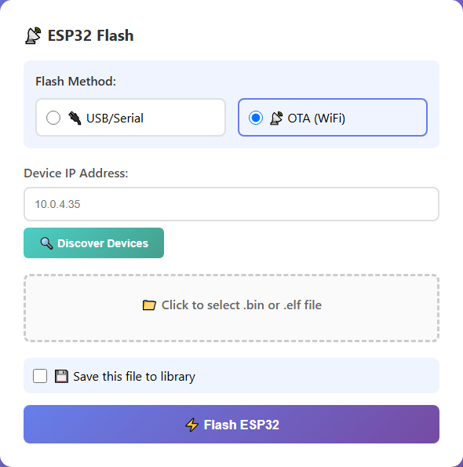
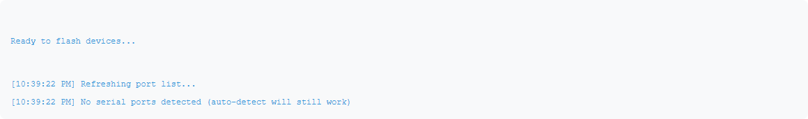

# Flashing Devices

The Device Flash Manager has two cards — one for the **FPGA** and one for the **ESP32**. Both work the same way: pick a flash method, select a file, and click Flash.

---

## Choosing a Flash Method

Each card starts with a **Flash Method** selector:

- **📡 OTA (WiFi)** — flash a device over your network. No cable needed; the device must be running FPGA-Companion and connected to the same network.
- **🔌 USB/Serial** — flash a device connected by USB-C cable. Required for first-time setup (before FPGA-Companion is installed).

---

## Flashing the FPGA (Gowin Bitstreams)

The FPGA card accepts `.bin` bitstream files (for example, a compiled A2600Nano or C64Nano core) and writes them to the Tang Primer 20K's external flash using pesptool.

**OTA (WiFi) mode:**

1. Enter the device's IP address — or click **🔍 Discover Devices** to scan your network automatically
2. Click **📁 Click to select .bin file** and choose your bitstream
3. Click **⚡ Flash FPGA**
4. Watch progress in the Status Log — the device reboots into the new core when done

**USB/Serial mode:**

Select **🔌 USB/Serial** instead. Port selection lives under **⚙️ Advanced Options**, and defaults to auto-detect:

| Advanced option | Default | Notes |
|---|---|---|
| COM Port | 🔍 Auto-detect | Click **🔄 Refresh** after plugging in a device |
| Verify after flashing | On | Reads back and confirms the write |
| Flash Address | `0x100000` | Bitstream offset in external flash — leave as-is for Retrocade |
| Show command and detailed output | Off | Logs the full pesptool command line and output |

---

## Flashing the ESP32 (FPGA-Companion Firmware)

The ESP32 card accepts `.bin` or `.elf` firmware files and flashes them with the official Espressif esptool.

The workflow is identical to the FPGA card. The Advanced Options differ only in flash address:

| Advanced option | Default | Notes |
|---|---|---|
| Flash Address | `0x10000` | Standard app partition. Use `0x1000` only when flashing a bootloader image |

:::warning
For a brand-new ESP32-S3 that has never run FPGA-Companion, OTA is not available yet — use **USB/Serial** with the device in bootloader mode (hold BOOT while plugging in USB). See [Flash the Firmware](../getting-started/flash-firmware) for the full first-time procedure.
:::

---

## OTA Device Discovery

Clicking **🔍 Discover Devices** scans your local subnet for devices answering on the OTA port (3232) and lists them for one-click selection. Discovery works for both cards.

Under the hood, FPGA-Companion exposes two HTTP endpoints on port 3232:

- `POST http://DEVICE_IP:3232/update` — ESP32 firmware update
- `POST http://DEVICE_IP:3232/fpga-update` — FPGA bitstream update

If discovery finds nothing but you know the device's IP, just type it into the **Device IP Address** field directly.

---

## The Status Log

Every action — port refreshes, uploads, flash progress, errors — is logged with timestamps and color coding at the bottom of the page:

- **Keep history** — retain messages between operations instead of clearing on each flash
- **🗑️ Clear Log** — wipe the log display

---

## Next Step

Save your frequently-used firmware so you never have to hunt for files again:

**[Saved Files Library →](./saved-files-library)**

---

## 🎓 Want to Go Deeper?

Ever wondered why the FPGA bitstream lives at `0x100000` while ESP32 firmware goes to `0x10000`? The FPGA Fundamentals course covers flash memory maps, the SPI link between the ESP32 and FPGA, and how to debug flashing issues with AI.

**[FPGA Fundamentals: AI as Your Co-Developer →](https://learn.papilioworks.com)**
