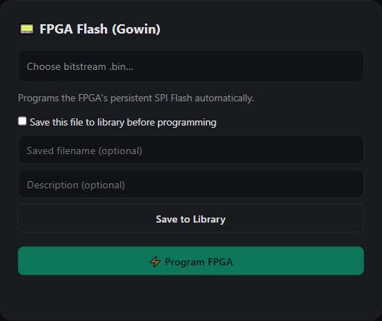
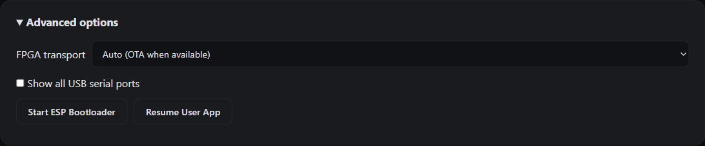

# Flashing Devices

The Loader has two cards: one for the **FPGA** and one for the **ESP32**. Pick a file, press the program button, and Loader handles the rest. It connects over USB, starts the bootloader on your board, and chooses the best way to send the file.

---

## Connect Your Board

1. Plug the ESP32-S3 into your computer with a USB data cable.
2. Select a file and press **Program FPGA** or **Program ESP32**. Loader requests
   USB access when needed. In the Web Edition, authorize the board in the browser
   serial-port chooser; Electron selects a recognized Papilio board automatically.
3. To help Loader locate a board on WiFi, open **Board Status** and click
   **Find My IP**, or type its address and click **Use This IP**.

For first-time WiFi configuration, use Step 2 of the
[guided Getting Started flasher](https://papilioworks.com/getting-started/).
The current full loader keeps its older **Connect & Locate Device** panel hidden,
so you do not need to find a Connect USB or Scan LAN button before programming.

---

## Programming the FPGA

Use this to load a game core or your own design.

1. Click the file picker on the **FPGA Flash** card and choose a Gowin `.bin` bitstream.
2. Click **Program FPGA**.
3. Watch the progress bar. When it finishes, the board returns to your application automatically and the new core starts.

*Save controls are desktop-only. The Web Edition uses the same file picker and
Program FPGA button without those controls.*

The core is written to the FPGA's flash, so it is still there after you power the board off.

:::warning[Only .bin files work]
Loader needs Gowin's headerless **Binary File** (`.bin`) export. It checks the file before sending and rejects `.fs` files, ESP32 firmware, and anything else that isn't a Gowin bitstream.
:::

---

## Programming the ESP32

Use this to install or update FPGA-Companion.

1. Click the file picker on the **ESP32 Flash** card and choose a firmware `.bin`.
2. Click **Program ESP32**.

Loader detects which kind of file you chose:

| File | What Loader does |
|---|---|
| **Merged image** (for a new or recovered board) | Writes the whole flash over USB, including the bootloader. Use this for first-time setup and recovery. |
| **App-only image** (an FPGA-Companion update) | Starts the bootloader and installs the update beside your current version. The board restarts into the new version when it is done. |

An app-only update never touches the bootloader, so it can't lock you out of your board.

---

## USB or WiFi?

By default, Loader uses WiFi when it knows your board's IP address and falls back to USB when it doesn't. To choose yourself, open **Advanced options** and set **FPGA transport**:

- **Auto** uses WiFi when available.
- **OTA / WiFi only** never uses USB.
- **USB / Serial only** never uses WiFi.

WiFi is faster and needs no cable to your computer. USB works any time the board is plugged in.

An ESP32 merged-image install always uses USB regardless of this setting.

---

## Board Status and Recovery

The **Board Status** panel shows whether the board is running the **bootloader** or your **application** (FPGA-Companion), plus its IP address. Under **Advanced options**:

- **Start ESP Bootloader** restarts the board into the bootloader.
- **Resume User App** returns to your application. Loader does this for you after programming.

For a board that will not start, use the guided
[Getting Started flasher](https://papilioworks.com/getting-started/) and
**Install / Recover Board**. See [Troubleshooting](./troubleshooting).

---

## The Status Log

Actions and errors appear in **Status Log**. Use **Open Log** to watch live boot
messages over USB, **Close Log** to release the USB log connection, and
**Clear Log** to clear its output. Device messages may include their own timestamps.

For cable-free debug output in the Desktop App, use the separate
[WiFi Log Monitor](./wifi-log-monitor).

---

## Next Step

Keep your favorite cores and firmware handy:

**[Saved Files Library →](./saved-files-library)**

---

## 🎓 Want to Go Deeper?

Ever wondered how a bitstream gets from your computer into the FPGA's flash? The FPGA Fundamentals course covers flash memory, the link between the ESP32 and FPGA, and how to debug programming problems with AI.

**[FPGA Fundamentals: AI as Your Co-Developer →](https://learn.papilioworks.com)**
