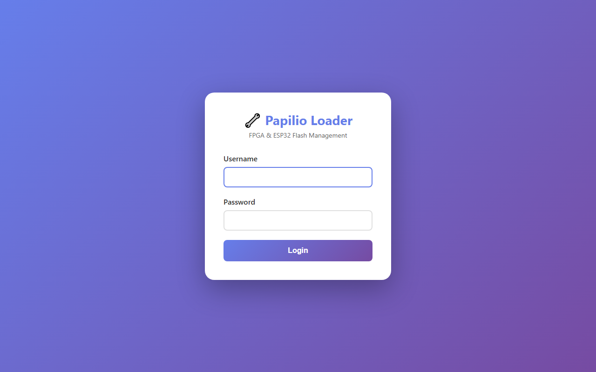

# Papilio Loader

Papilio Loader is the official tool for flashing Papilio hardware. It programs both chips on your Retrocade setup:

- **FPGA (Gowin)** — writes bitstreams to the Tang Primer 20K's external flash
- **ESP32-S3** — writes FPGA-Companion firmware to the ESP32-S3 SuperMini

It runs as a small local server on your computer and gives you three ways to work:

| Interface | Best For | Where |
|---|---|---|
| **Web Interface** | Manual flashing, everyday use | `http://localhost:8000/web/upload` |
| **REST API** | Automation, scripts, CI/CD | `http://localhost:8000/docs` |
| **MCP Server** | AI-assisted workflows (Claude, Copilot) | `http://localhost:8000/sse` |

All three run simultaneously from a single server process.

---

## Key Features

- **USB/Serial flashing** — program devices over a USB-C cable with automatic port detection
- **OTA (WiFi) flashing** — update devices over your network with no cable at all, including automatic device discovery
- **Saved Files Library** — keep frequently-used firmware on hand with names and descriptions, and export/import the whole library as a ZIP
- **WiFi Log Monitor** — watch live debug output from FPGA-Companion over the network
- **Safe dual-tool design** — the official Espressif `esptool` handles ESP32 flashing; the GadgetFactory `pesptool` fork handles FPGA bitstreams

---

## Installation

There are two ways to install Papilio Loader:

| Method | Platforms | Best For |
|---|---|---|
| **Windows Installer** | Windows 10/11 (64-bit) | One-click setup, no Python required |
| **Python Package** | Windows, Mac, Linux | Cross-platform, scripting, always up to date via pip |

### Option A: Windows Installer (Recommended for Windows)

No Python required — everything is bundled into a standard desktop app:

1. Download `PapilioLoader-Setup-x.x.x.exe` from the [releases page](https://github.com/Papilio-Labs/papilio-loader-mcp/releases)
2. Run the installer. During setup you can optionally enable:
   - **Create a desktop icon**
   - **Run at Windows startup** — the loader is always ready in your system tray
   - **Add pesptool.exe and esptool.exe to system PATH** — use the flashing tools directly from any command prompt
3. Launch **Papilio Loader** from the Start Menu
4. A system tray icon appears — right-click it and choose **Open Web Interface**

The installer also adds Start Menu shortcuts for:

- **Papilio Loader (Debug Console)** — runs the app with a visible console window so you can see server output, handy for troubleshooting
- **pesptool / esptool Command Prompt** — opens a command prompt with the standalone flashing tools ready to use

:::note
The desktop app runs the exact same server and web UI described throughout these docs — only the way you start it differs.
:::

### Option B: Python Package (Windows, Mac, Linux)

Install with pip — identical on every platform:

```bash
pip install papilio-loader-mcp
```

:::tip
Don't have Python? Download it from [python.org](https://www.python.org/downloads/) — Python 3.12 or newer is required.
:::

---

## Starting the Server

**Desktop app:** launch Papilio Loader from the Start Menu (or let it start with Windows), then right-click the tray icon and choose **Open Web Interface**.

**Python package:** run the server from a terminal:

```bash
python -m papilio_loader_mcp.api
```

Either way, the web interface lives at **[http://localhost:8000/web/upload](http://localhost:8000/web/upload)**. You should see the Device Flash Manager:


---

## Login (Optional)

By default the web interface is open for local use — no login required. If you plan to expose the loader on your network, enable authentication first:

```bash
# Windows (PowerShell)
$env:PAPILIO_REQUIRE_WEB_AUTH = "true"
$env:PAPILIO_WEB_USERNAME = "your_username"
$env:PAPILIO_WEB_PASSWORD = "a_strong_password"

# Mac/Linux
export PAPILIO_REQUIRE_WEB_AUTH=true
export PAPILIO_WEB_USERNAME=your_username
export PAPILIO_WEB_PASSWORD=a_strong_password
```

With authentication enabled, you'll see a login screen before the flash manager:



---

## Next Step

Ready to flash your first device:

**[Flashing Devices →](./flashing-devices)**

---

## 🎓 Want to Go Deeper?

Curious what actually happens when a bitstream is written to flash, or how the ESP32 loads the FPGA at boot? The FPGA Fundamentals course walks through the whole boot chain — with AI as your co-developer.

**[FPGA Fundamentals: AI as Your Co-Developer →](https://learn.papilioworks.com)**
