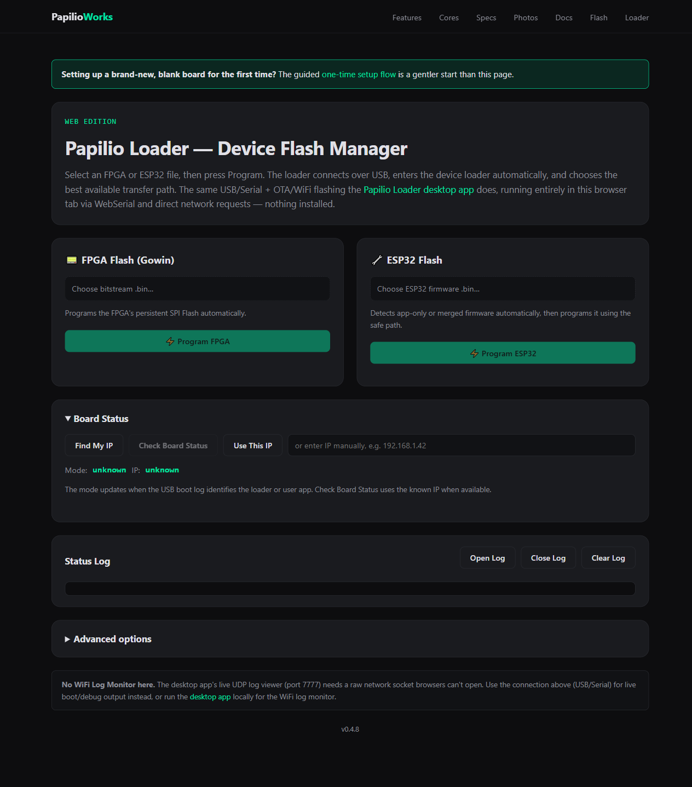
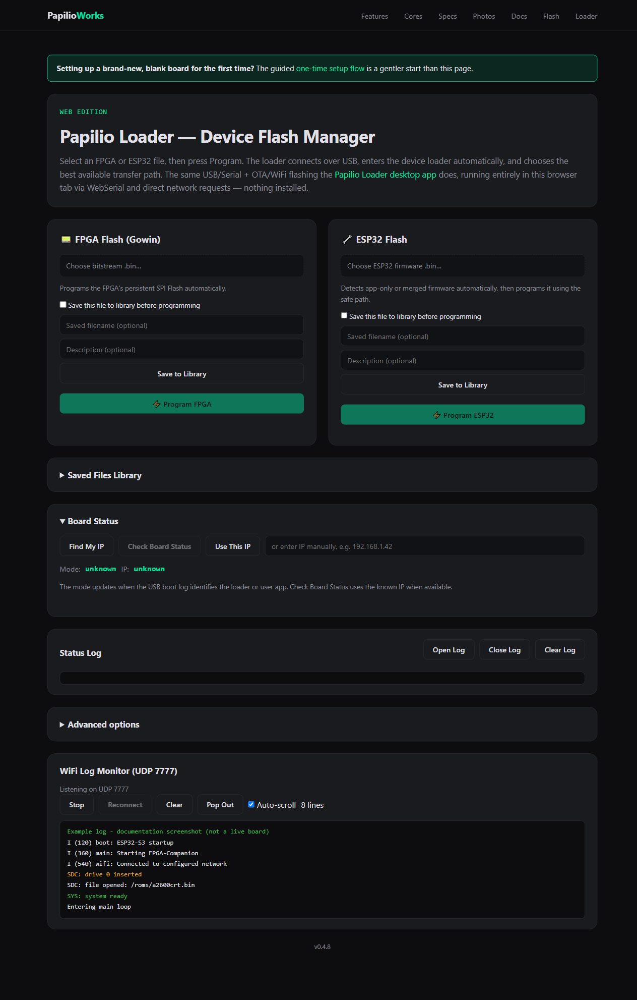

# Papilio Loader

Papilio Loader is the official tool for programming Papilio hardware. It programs both chips on your Retrocade:

- **FPGA (Gowin):** writes a game core or your own design to the FPGA's flash, so it stays loaded after power-off.
- **ESP32-S3:** installs and updates the FPGA-Companion firmware.

Both work over **USB** or **WiFi**. Loader talks to the [Papilio ESP Bootloader](../getting-started/index.md#what-is-the-papilio-esp-bootloader) on your board, which is what makes programming and recovery reliable.

This guide covers **Papilio Loader v0.4.8**, the current Electron desktop app and
its shared Web Edition. There is no Python server to start and no loader login.

---

## Two Ways to Run It

| Version | Best For | What You Need |
|---|---|---|
| **Web Edition** | Quick programming with nothing to install | Chrome or Edge on a desktop computer |
| **Desktop App** | Everyday use, finding boards on your network, WiFi logs, and AI assistants | Windows 10/11 (64-bit) |

### Web Edition

Open **[papilioworks.com/loader](https://papilioworks.com/loader/)** in Chrome or Edge. It connects to your board over USB using Web Serial, and sends files over WiFi directly from your browser. Nothing is installed, and your files never leave your computer.

:::note
Web browsers cannot receive raw UDP logs or access the desktop saved-file store.
Use **Find My IP** or a manually entered IP in **Board Status**, and the USB
**Status Log** for live output. The Saved Files Library and WiFi Log Monitor are
desktop-only.
:::

### Desktop App

1. Download `PapilioLoader-Setup-x.x.x.exe` from the [releases page](https://github.com/Papilio-Labs/papilio-loader-mcp/releases).
2. Run the installer and launch **Papilio Loader** from the Start Menu.

The published installer supports **Windows x64**. On macOS or Linux, use the
Web Edition in Chrome or Edge; this release does not include desktop installers
for those platforms. The Windows installer is unsigned, so SmartScreen may
display a warning.

The Desktop App uses the same interface as the Web Edition and adds:

- **[Saved Files Library](./saved-files-library)**: save without programming,
  load, filter, rename, edit descriptions, delete, and ZIP backup/import
- **[WiFi Log Monitor](./wifi-log-monitor)**: inline and pop-out terminals with
  Stop, Reconnect, Clear, auto-scroll, and ANSI colors
- **AI assistant support** through a built-in MCP server (see [API & Automation](./api-and-automation))

*Desktop screenshots use example saved files and clearly labeled example logs.
The shared page still displays "Web Edition" in its heading inside Electron;
the save controls and WiFi monitor distinguish the desktop interface.*

Closing the main window hides it to the **system tray**, keeping the app and MCP
server running. Click the tray icon to reopen it, or choose **Quit** to exit.
A WiFi log pop-out can remain open while the main window is hidden.

---

## First-Time Setup of a New Board

If your board is brand new, or you're recovering one, use the guided **[Getting Started flasher](https://papilioworks.com/getting-started/)**. Its four steps install the bootloader and FPGA-Companion, configure WiFi, install the Atari 2600 core, and load a demo ROM onto an SD card. See [Flash the Firmware](../getting-started/flash-firmware) for the steps.

---

## Next Step

Learn how to program your FPGA and ESP32:

**[Flashing Devices →](./flashing-devices)**

---

## 🎓 Want to Go Deeper?

Understanding what happens when you program an FPGA, from bitstream to flash to configuration, makes everything easier to debug. The FPGA Fundamentals course covers it with AI as your guide.

**[FPGA Fundamentals: AI as Your Co-Developer →](https://learn.papilioworks.com)**
