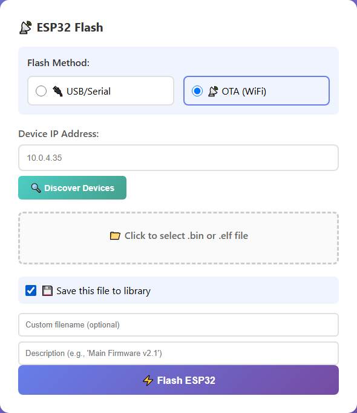

# Saved Files Library

The Saved Files Library keeps your frequently-used bitstreams and firmware inside the loader, so you can re-flash a device in two clicks — no digging through your Downloads folder.

---

## Saving a File

When flashing either device, check **💾 Save this file to library** before clicking Flash:

Two optional fields appear:

- **Custom filename** — a friendly name like `a2600nano-v1.2.bin`
- **Description** — free-form notes, e.g. *"Atari 2600 core, HDMI audio fix"*

The file is stored on the server when the flash begins, tagged as FPGA or ESP32 automatically.

---

## Browsing the Library

Click the **💾 Saved Files Library** toggle on the main page to expand it. Files are organized into tabs:

- **All Files** — everything in the library
- **FPGA** — bitstreams only
- **ESP32** — firmware only

Each saved file offers:

| Action | What it does |
|---|---|
| **📥 Load** | Loads the file straight into the matching flash card — just pick a target and click Flash |
| **📝 Rename** | Change the display name |
| **📝 Edit Description** | Update your notes |
| **🗑️ Delete** | Remove the file from the library |

---

## Export and Import (ZIP)

The library can be backed up or shared as a single ZIP archive:

- **⬇️ Export ZIP** — downloads every saved file plus its metadata (names, descriptions, device types)
- **⬆️ Import ZIP** — restores a previously exported archive, merging it into your library

This is handy for moving your setup to another computer, or handing a teammate a complete, described set of known-good firmware.

---

## Next Step

Watch live debug output from your device over WiFi:

**[WiFi Log Monitor →](./wifi-log-monitor)**

---

## 🎓 Want to Go Deeper?

Building your own cores means building your own library of bitstreams. The Retro Core Development course teaches you to port and customize FPGA cores — with AI accelerating every step.

**[Explore the Courses →](https://learn.papilioworks.com)**
