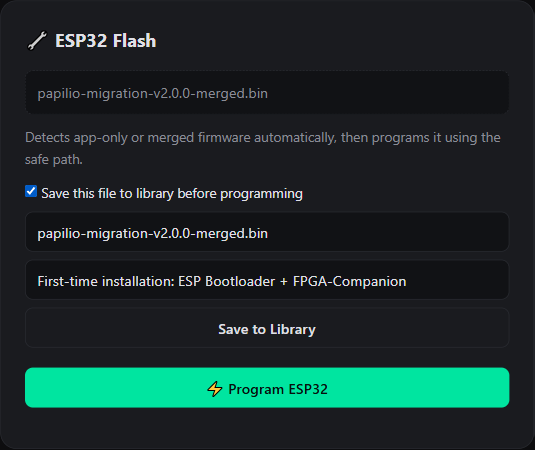
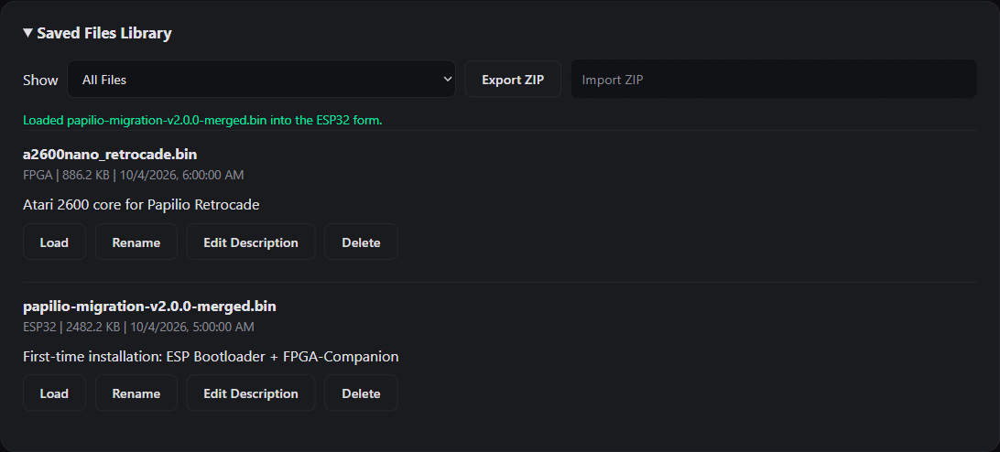

# Saved Files Library

The Saved Files Library keeps your frequently-used bitstreams and firmware inside the loader, so you can re-flash a device in two clicks — no digging through your Downloads folder.

:::note[Desktop only]
This library is part of the **Electron Desktop App**, starting with v0.4.8.
The Web Edition uses your computer's file picker instead. Files are stored in
the desktop app's local user-data directory, not on a web server.
:::

---

## Saving a File

1. Choose a valid `.bin` in the **FPGA Flash (Gowin)** or **ESP32 Flash** card.
2. Optionally enter a **Saved filename** and **Description**.
3. Click **Save to Library**. You do not need a board connected to save a file.

You can also check **Save this file to library before programming**, then click
**Program FPGA** or **Program ESP32**. The file is saved before hardware access
begins. If saving fails, programming does not start; if programming fails after a
successful save, the file stays in your library.

The checkbox clears after a successful save to avoid saving the same file again.
When you omit `.bin` from a saved filename or rename, Loader adds it.

---

## Browsing the Library

Expand **Saved Files Library** below the programming cards. Use the **Show**
dropdown to choose **All Files**, **FPGA**, or **ESP32**.

*The screenshot contains example file names and descriptions. Your library
starts empty and shows the files you save or import.*

Each file displays its name, device type, size, save date, and description:

| Action | What it does |
|---|---|
| **Load** | Restores the file to the matching programming card and runs image validation; it does not program the board |
| **Rename** | Opens a dialog to change the filename |
| **Edit Description** | Opens a dialog to update your notes |
| **Delete** | Removes the file after you confirm |

After **Load**, click **Program FPGA** or **Program ESP32** when ready.

---

## Export and Import (ZIP)

The library can be backed up or shared as a single ZIP archive:

- **Export ZIP** downloads the entire library, regardless of the current Show
  filter, including names, descriptions, device types, and save dates.
- **Import ZIP** lets you select a backup and adds its files to your library.
  Imports use new IDs, so existing files are not overwritten even if names match.

This is handy for moving your setup to another computer, or handing a teammate a complete, described set of known-good firmware.

### Migrating from the Python Loader

1. In the old Python loader, use **Export ZIP**.
2. In the Electron app, expand **Saved Files Library** and use **Import ZIP**.
3. Select the old export. Loader accepts its `manifest.json` archive format as
   well as the current Electron format.

The Electron app does not open or modify the old SQLite database.

:::note[Storage and limits]
Electron stores `saved_files_index.json` and the file data in a `saved_files`
folder under its local user-data directory (under `%APPDATA%` on Windows).
Individual files and imported ZIPs are limited to 50 MB; one import's total
uncompressed file content is also limited to 50 MB. Invalid or incomplete
archives are reported rather than silently skipped.
:::

---

## Next Step

Watch live debug output from your device over WiFi:

**[WiFi Log Monitor →](./wifi-log-monitor)**

---

## 🎓 Want to Go Deeper?

Building your own cores means building your own library of bitstreams. The Retro Core Development course teaches you to port and customize FPGA cores — with AI accelerating every step.

**[Explore the Courses →](https://learn.papilioworks.com)**
