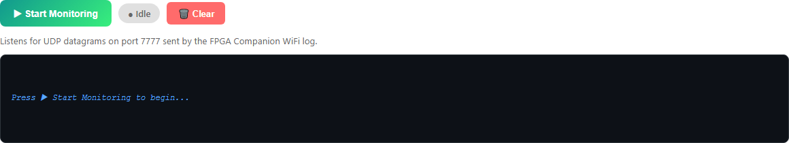
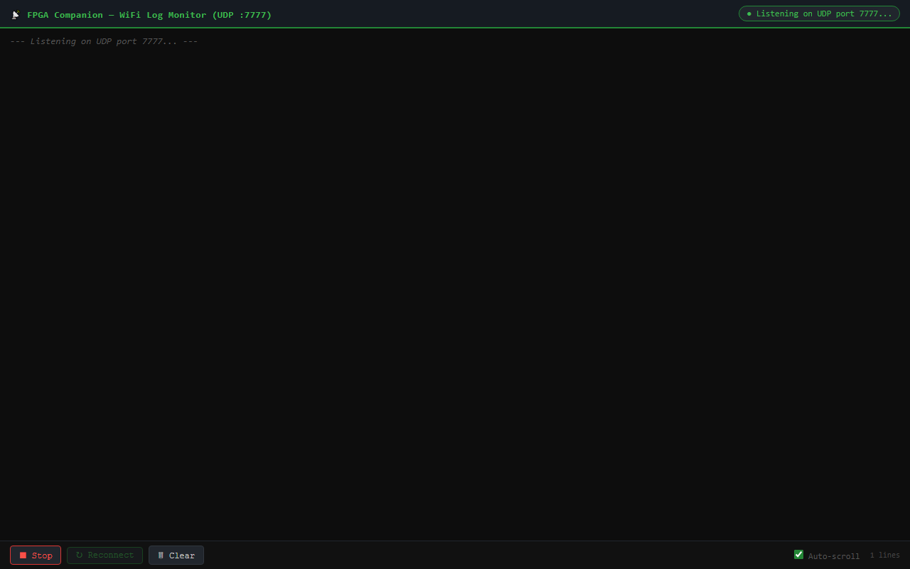

# WiFi Log Monitor

FPGA-Companion can broadcast its debug log over the network as UDP datagrams on **port 7777**. The WiFi Log Monitor captures that stream live in your browser — no serial cable, no terminal program.

This is perfect for debugging a console that's plugged into your TV across the room.

---

## Using the Inline Monitor

On the main flash page, click the **WiFi Log Monitor** toggle to expand the log panel:

- **▶ Start Monitoring** — begins listening for UDP log packets on port 7777
- **Status badge** — shows **● Idle**, listening, or receiving states
- **🗑️ Clear** — wipes the log display
- **🔎 Pop Out** — opens the monitor in its own window

Once monitoring starts, log lines from any FPGA-Companion device on your network appear in real time.

---

## The Pop-Out Log Window

For longer debugging sessions, use the dedicated full-screen log page at `/web/wifi-log` (or click **🔎 Pop Out**):

The pop-out window streams the same UDP log via server-sent events, so it keeps scrolling while you flash devices or work in the main window.

:::tip
Combine the pop-out log with an OTA flash: start monitoring, kick off a flash, and watch the device's boot messages appear the moment it restarts with the new firmware.
:::

---

## Enabling WiFi Logging on the Device

The device side is handled by FPGA-Companion — once it's connected to WiFi, it sends its log output as UDP broadcasts automatically. If you see nothing:

1. Confirm the device is on the same network/subnet as your computer
2. Check that your firewall allows inbound UDP on port 7777
3. Verify the device actually booted (try the serial monitor over USB as a fallback)

---

## Next Step

Automate the loader with its REST API or connect it to your AI assistant:

**[API & Automation →](./api-and-automation)**

---

## 🎓 Want to Go Deeper?

Reading logs is step one — understanding them is the skill. The FPGA Debugging with AI course shows you how to turn cryptic boot output into fixes, fast.

**[Explore the Courses →](https://learn.papilioworks.com)**
