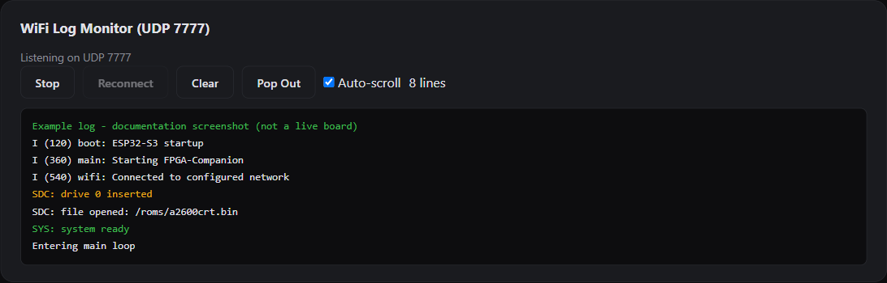
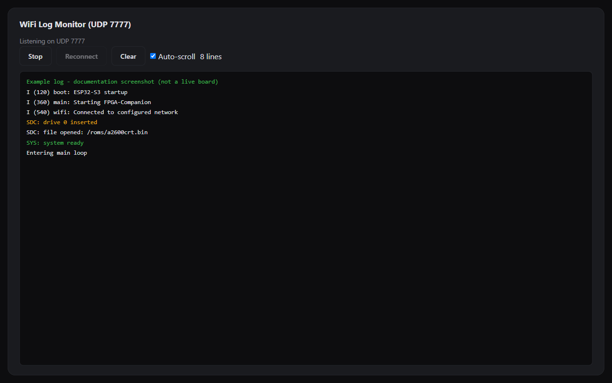

# WiFi Log Monitor

FPGA-Companion and the Papilio ESP Bootloader can broadcast debug output as UDP
datagrams on **port 7777**. The **Electron Desktop App** receives those packets
and displays them in its inline monitor and optional pop-out terminal.

This is perfect for debugging a console that's plugged into your TV across the room.

:::note[Desktop only]
The hosted Web Edition cannot open a raw UDP socket. Use its USB **Status Log**
instead, or install the Desktop App. The Electron monitor does not require a
Python server, login, or server-sent events.
:::

---

## Using the Inline Monitor

The **WiFi Log Monitor (UDP 7777)** appears below **Advanced options** in the
Desktop App and starts listening automatically. There is no Start Monitoring
button to press.



*These screenshots show labeled example log output, not a live board session.*

| Control | What it does |
|---|---|
| **Stop** | Stops this view's subscription |
| **Reconnect** | Restarts this view after stopping or a listener error |
| **Clear** | Clears this view's displayed lines without stopping reception |
| **Pop Out** | Opens a separate resizable terminal, or focuses the existing one |
| **Auto-scroll** | Follows new output when checked; turn it off to read earlier lines |

The status reads **Listening on UDP 7777** once the socket is ready. Device logs
retain their ANSI colors. Each view keeps the latest **2,000 lines** and displays
its current line count. Packets from multiple boards on the network can appear
in the same monitor.

---

## The Pop-Out Log Window

Click **Pop Out** for a dedicated terminal. Resize or maximize the window: the
log pane fills the available width and height.



Both views share one UDP socket, but have independent controls and histories.
Stopping, clearing, or closing the pop-out does not stop the inline monitor.
Closing the main app window hides it to the tray, so the pop-out can remain open.
Use **Quit** in the tray menu to exit the app and close both windows.

The pop-out receives new output when it opens; it does not copy the inline
monitor's existing history.

:::tip
Combine the pop-out log with an OTA flash: start monitoring, kick off a flash, and watch the device's boot messages appear the moment it restarts with the new firmware.
:::

---

## Enabling WiFi Logging on the Device

The device side is handled by FPGA-Companion — once it's connected to WiFi, it sends its log output as UDP broadcasts automatically. If you see nothing:

1. Confirm the device is on the same network/subnet as your computer
2. Check that your firewall allows inbound UDP on port 7777
3. Verify the device actually booted (try the serial monitor over USB as a fallback)

If listening fails, the monitor displays the error and enables **Reconnect**.
For a Windows access-permission error, it also shows firewall guidance. If you
need an inbound rule, run this in an **elevated PowerShell**:

```powershell
netsh advfirewall firewall add rule name="FPGA WiFi Log UDP 7777" dir=in action=allow protocol=UDP localport=7777
```

Prefer trusted private networks. Guest WiFi or client isolation can block
broadcast traffic even when internet access works.

---

## Next Step

Connect the desktop loader to your AI assistant through its local MCP server:

**[API & Automation →](./api-and-automation)**

---

## 🎓 Want to Go Deeper?

Reading logs is step one — understanding them is the skill. The FPGA Debugging with AI course shows you how to turn cryptic boot output into fixes, fast.

**[Explore the Courses →](https://learn.papilioworks.com)**
